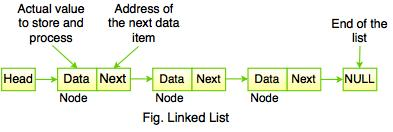
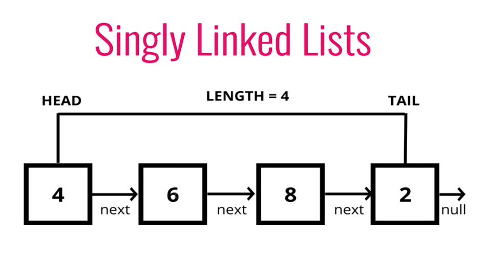

# Linked List

## What is a Linked List?

A linked list is a linear data structure, in which the elements are not stored at contiguous memory locations.
The elements in a linked list are linked using pointers.

In simple words, a linked list consists of nodes where each node contains a data field and a reference (link)
to the next node in the list.

## Example: Finding Middle Element in a Linked List

The task is to find the **middle** of the linked list.

* Given a single linked list of N nodes.

**Expected Time Complexity:** O(N)
**Expected Auxiliary Space:** O(1) 

**Input:**
LinkedList: 1->2->3->4->5

**Output:** 3

**Explanation:**
Middle of linked list is 3.

## Problem to Solve:

Write a Python program to create a singly linked list, append some items and iterate through the list.

## Solution:

class Node:
    # Singly linked node
    def __init__(self, data=None):
        self.data = data
        self.next = None
class singly_linked_list:
    def __init__(self):
        # Createe an empty list
        self.head = None
        self.tail = None
        self.count = 0
    def iterate_item(self):
        # Iterate the list.
        current_item = self.head
        while current_item:
            val = current_item.data
            current_item = current_item.next
            yield val
    def append_item(self, data):
        #Append items on the list
        node = Node(data)
        if self.tail:
            self.tail.next = node
            self.tail = node
        else:
            self.head = node
            self.tail = node
        self.count += 1
items = singly_linked_list()
items.append_item('PHP')
items.append_item('Python')
items.append_item('C#')
items.append_item('C++')
items.append_item('Java')
for val in items.iterate_item():
    print(val)
print("\nhead.data: ",items.head.data)
print("tail.data: ",items.tail.data)
