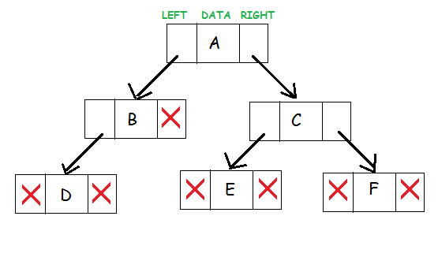

# Tree

## What is a Binary Tree Data Structure?

A Binary Tree is defined as a tree data structure where each node has at most 2 children. Since each element
in a binary tree can have only 2 children, we typically name them the left and right child.

## Binary Tree Representation

A Binary tree is represented by a pointer to the topmost node (commonly known as the "rooot") of the tree. If
the tree is empty, then the value of the root is NULL> Each node of a Binary Tree contins the following parts:

1. Data
2. Pointer to the left child
3. Pointer to the right child

## Basic Operation On Binary Tree:

* Inserting an element.
* Removing an element.
* Searching for an element.
* Traversing the tree.

## Auxiliary Operation On Binary Tree

* Finding the height of the tree.
* Find the level of a node of the tree.
* Finding the size of the entire tree.

## Example: Check for BST

Given the root of a binary tree. Check whether it is a BST or not.

* The left subtree of a node contains only nodes with keys less than the node's key.
* The right subtree of a node contains only nodes with keys greater than the node's key.
* Both the left and right subtrees must also be binary search trees. 

**Input:**
   2
 /    \
1      3

**Output:** 1 

**Explanation:**
The left subtree of root node contains node
with key lesser than the root nodes key and 
the right subtree of root node contains node 
with key greater than the root nodes key.
Hence, the tree is a BST.

## Problem to Solve:

Write a Python program to find the closest value to a given target value in a given non-empty 
Binary Search Tree (BST) of unique values.

## Solution:

class TreeNode(object):
    def __init__(self, x):
        self.val = x
        self.left = None
        self.right = None

def closest_value(root, target):
    a = root.val
    kid = root.left if target < a else root.right
    if not kid:
        return a
    b = closest_value(kid, target)
    return min((a,b), key=lambda x: abs(target-x))

root = TreeNode(8)  
root.left = TreeNode(5)  
root.right = TreeNode(14) 
root.left.left = TreeNode(4)  
root.left.right = TreeNode(6) 
root.left.right.left = TreeNode(8)  
root.left.right.right = TreeNode(7)  
root.right.right = TreeNode(24) 
root.right.right.left = TreeNode(22)  
    
result = closest_value(root, 19)
print(result)
